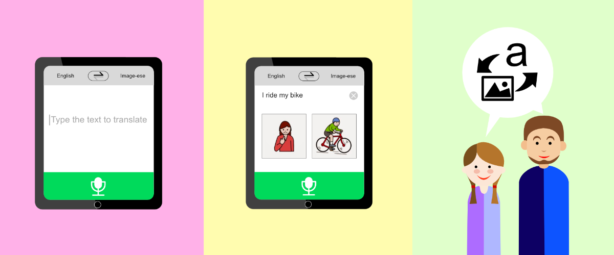

# American Sign Language Converter

## Background
* Disclaimer: This repository is covering a part of project [**iSee iSpeak**](https://www.ischool.berkeley.edu/projects/2017/iseeispeak). 
* iSee iSpeak is an intelligent image-based communication system for nonverbal children. In essense, it is a machine translator from written English to pictogram. Pictogram language is widely used in speech therapy. For example, pictogram can help children with ASD (Autism Spectrum Disorders), who have verbal challenges, to communicate visually. This is where team iSeeiSpeak started.

## What is iSeeiSpeak?
iSee iSpeak is a project name as well as the product name. Our team is trying to help non-verbal children to communicate verbally with pictures. We use a specifc school of pictures, called [PECS (Picture Exchange Communication System)](http://www.pecs.com/). Using PECS images, a caretaker can input a sentence to iSeeiSpeak, which it will translate into picrtures, and then presented to a child with ASD.

## Why ASL (American Sign Language)?
As you may already know, in order to train a machine translator, one needs a parallel corpus of two (or more) languages. Unfortunately, there is no such corpus for our purpose. So we decided to create our own corpus in two main streams: bootstrapping method and crowd sourcing. ASL converter is the former of the two. ASL is a visual language as people who speak it communicate using hand signals. After much research and expert interviews, we have come to realize that ASL will be a great way to start forming parallel corpus for English and pictogram. 

## Who are we?
I am [Doran Bae](https://www.linkedin.com/in/doranbae/), and my teammates and I are part of [UC Berkeley's MIDS program](https://datascience.berkeley.edu/) This is the program's Capstone project for Summer 2017.